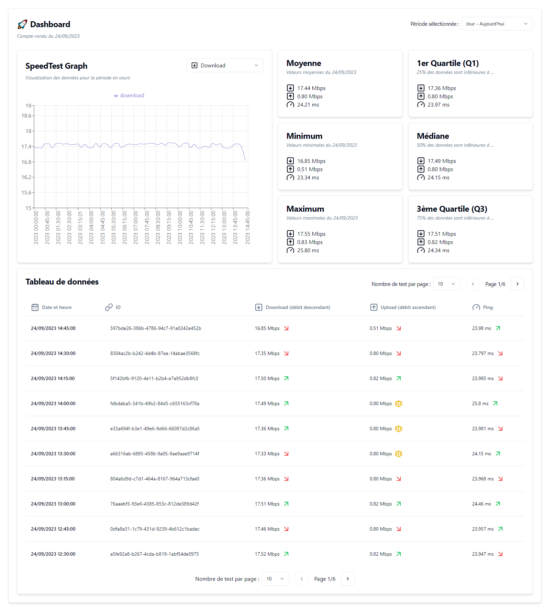

<h1 align="center">SpeedTest Tracker 🚀</h1>

A full-stack web application for monitoring internet speed test data, including a Node.js backend with an API for data retrieval and a script with a CRON task to generate a JSON file periodically. A React frontend is available for visualization of key metrics.

[📅 Day](https://github.com/baptistelechat/Speedtest-tracker/tree/main/api#-day)
[📅 Week](https://github.com/baptistelechat/Speedtest-tracker/tree/main/api#-week)
[📅 Month](https://github.com/baptistelechat/Speedtest-tracker/tree/main/api#-month)

## 📸 Project's Screenshots

### Main page



## 📚 API Reference

### 📅 Day

#### 📂 Day - Base

##### GET data of today

```http
GET /api/speedTest/day/today
```

##### GET last data of today

```http
GET /api/speedTest/day/last
```

##### GET data of yesterday

```http
GET /api/speedTest/day/yesterday
```

##### GET data of a specific date

```http
GET /api/speedTest/day/:filename
```

| Parameter  | Type     | Description                                                   |
| :--------- | :------- | :------------------------------------------------------------ |
| `filename` | `string` | **Required**. filename is "date" to fetch. Format is YYYYMMDD |

#### 📂 Day - Average

##### GET average data of today

```http
GET /api/speedTest/day/today/average
```

##### GET average data of yesterday

```http
GET /api/speedTest/day/yesterday/average
```

##### GET average data of a specific date

```http
GET /api/speedTest/day/:filename/average
```

| Parameter  | Type     | Description                                                   |
| :--------- | :------- | :------------------------------------------------------------ |
| `filename` | `string` | **Required**. filename is "date" to fetch. Format is YYYYMMDD |

#### 📂 Day - Max

##### GET max data of today

```http
GET /api/speedTest/day/today/max
```

##### GET max data of yesterday

```http
GET /api/speedTest/day/yesterday/max
```

##### GET max data of a specific date

```http
GET /api/speedTest/day/:filename/max
```

| Parameter  | Type     | Description                                                   |
| :--------- | :------- | :------------------------------------------------------------ |
| `filename` | `string` | **Required**. filename is "date" to fetch. Format is YYYYMMDD |

#### 📂 Day - Min

##### GET min data of today

```http
GET /api/speedTest/day/today/min
```

##### GET min data of yesterday

```http
GET /api/speedTest/day/yesterday/min
```

##### GET min data of a specific date

```http
GET /api/speedTest/day/:filename/min
```

| Parameter  | Type     | Description                                                   |
| :--------- | :------- | :------------------------------------------------------------ |
| `filename` | `string` | **Required**. filename is "date" to fetch. Format is YYYYMMDD |

#### 📂 Day - Q1

##### GET Q1 data of today

```http
GET /api/speedTest/day/today/q1
```

##### GET Q1 data of yesterday

```http
GET /api/speedTest/day/yesterday/q1
```

##### GET Q1 data of a specific date

```http
GET /api/speedTest/day/:filename/q1
```

| Parameter  | Type     | Description                                                   |
| :--------- | :------- | :------------------------------------------------------------ |
| `filename` | `string` | **Required**. filename is "date" to fetch. Format is YYYYMMDD |

#### 📂 Day - Q3

##### GET Q3 data of today

```http
GET /api/speedTest/day/today/q3
```

##### GET Q3 data of yesterday

```http
GET /api/speedTest/day/yesterday/q3
```

##### GET Q3 data of a specific date

```http
GET /api/speedTest/day/:filename/q3
```

| Parameter  | Type     | Description                                                   |
| :--------- | :------- | :------------------------------------------------------------ |
| `filename` | `string` | **Required**. filename is "date" to fetch. Format is YYYYMMDD |

#### 📂 Day - Median

##### GET median data of today

```http
GET /api/speedTest/day/today/median
```

##### GET median data of yesterday

```http
GET /api/speedTest/day/yesterday/median
```

##### GET median data of a specific date

```http
GET /api/speedTest/day/:filename/median
```

| Parameter  | Type     | Description                                                   |
| :--------- | :------- | :------------------------------------------------------------ |
| `filename` | `string` | **Required**. filename is "date" to fetch. Format is YYYYMMDD |

### 📅 Week

#### 📂 Week - Base

##### GET data of current week

```http
GET /api/speedTest/week/current
```

##### GET data of previous week

```http
GET /api/speedTest/week/previous
```

##### GET data for a specific week

```http
GET /api/speedTest/week/:weekNumber
```

| Parameter    | Type     | Description                                                             |
| :----------- | :------- | :---------------------------------------------------------------------- |
| `weekNumber` | `string` | **Required**. week number to fetch. Format is a string between 1 and 52 |

#### 📂 Week - Average

##### GET average data of current week

```http
GET /api/speedTest/week/current/average
```

##### GET average data of previous week

```http
GET /api/speedTest/week/previous/average
```

##### GET average data for a specific week

```http
GET /api/speedTest/week/:weekNumber/average
```

| Parameter    | Type     | Description                                                             |
| :----------- | :------- | :---------------------------------------------------------------------- |
| `weekNumber` | `string` | **Required**. week number to fetch. Format is a string between 1 and 52 |

#### 📂 Week - Max

##### GET max data of current week

```http
GET /api/speedTest/week/current/max
```

##### GET max data of previous week

```http
GET /api/speedTest/week/previous/max
```

##### GET max data for a specific week

```http
GET /api/speedTest/week/:weekNumber/max
```

| Parameter    | Type     | Description                                                             |
| :----------- | :------- | :---------------------------------------------------------------------- |
| `weekNumber` | `string` | **Required**. week number to fetch. Format is a string between 1 and 52 |

#### 📂 Week - Min

##### GET min data of current week

```http
GET /api/speedTest/week/current/min
```

##### GET min data of previous week

```http
GET /api/speedTest/week/previous/min
```

##### GET min data for a specific week

```http
GET /api/speedTest/week/:weekNumber/min
```

| Parameter    | Type     | Description                                                             |
| :----------- | :------- | :---------------------------------------------------------------------- |
| `weekNumber` | `string` | **Required**. week number to fetch. Format is a string between 1 and 52 |

#### 📂 Week - Q1

##### GET Q1 data of current week

```http
GET /api/speedTest/week/current/q1
```

##### GET Q1 data of previous week

```http
GET /api/speedTest/week/previous/q1
```

##### GET Q1 data for a specific week

```http
GET /api/speedTest/week/:weekNumber/q1
```

| Parameter    | Type     | Description                                                             |
| :----------- | :------- | :---------------------------------------------------------------------- |
| `weekNumber` | `string` | **Required**. week number to fetch. Format is a string between 1 and 52 |

#### 📂 Week - Q3

##### GET Q3 data of current week

```http
GET /api/speedTest/week/current/q3
```

##### GET Q3 data of previous week

```http
GET /api/speedTest/week/previous/q3
```

##### GET Q3 data for a specific week

```http
GET /api/speedTest/week/:weekNumber/q3
```

| Parameter    | Type     | Description                                                             |
| :----------- | :------- | :---------------------------------------------------------------------- |
| `weekNumber` | `string` | **Required**. week number to fetch. Format is a string between 1 and 52 |

#### 📂 Week - Median

##### GET median data of current week

```http
GET /api/speedTest/week/current/median
```

##### GET median data of previous week

```http
GET /api/speedTest/week/previous/median
```

##### GET median data for a specific week

```http
GET /api/speedTest/week/:weekNumber/median
```

| Parameter    | Type     | Description                                                             |
| :----------- | :------- | :---------------------------------------------------------------------- |
| `weekNumber` | `string` | **Required**. week number to fetch. Format is a string between 1 and 52 |

### 📅 Month

#### 📂 Month - Base

##### GET data for current month

```http
GET /api/speedTest/month/current
```

##### GET data for previous month

```http
GET /api/speedTest/month/previous
```

##### GET data for a specific month

```http
GET /api/speedTest/month/:monthNumber
```

| Parameter     | Type     | Description                                                              |
| :------------ | :------- | :----------------------------------------------------------------------- |
| `monthNumber` | `string` | **Required**. month number to fetch. Format is a string between 1 and 12 |

#### 📂 Month - Average

##### GET average data of current month

```http
GET /api/speedTest/month/current/average
```

##### GET average data of previous month

```http
GET /api/speedTest/month/previous/average
```

##### GET average data for a specific month

```http
GET /api/speedTest/month/:monthNumber/average
```

| Parameter     | Type     | Description                                                              |
| :------------ | :------- | :----------------------------------------------------------------------- |
| `monthNumber` | `string` | **Required**. month number to fetch. Format is a string between 1 and 12 |

#### 📂 Month - Max

##### GET max data of current month

```http
GET /api/speedTest/month/current/max
```

##### GET max data of previous month

```http
GET /api/speedTest/month/previous/max
```

##### GET max data for a specific month

```http
GET /api/speedTest/month/:monthNumber/max
```

| Parameter     | Type     | Description                                                              |
| :------------ | :------- | :----------------------------------------------------------------------- |
| `monthNumber` | `string` | **Required**. month number to fetch. Format is a string between 1 and 12 |

#### 📂 Month - Min

##### GET min data of current month

```http
GET /api/speedTest/month/current/min
```

##### GET min data of previous month

```http
GET /api/speedTest/month/previous/min
```

##### GET min data for a specific month

```http
GET /api/speedTest/month/:monthNumber/min
```

| Parameter     | Type     | Description                                                              |
| :------------ | :------- | :----------------------------------------------------------------------- |
| `monthNumber` | `string` | **Required**. month number to fetch. Format is a string between 1 and 12 |

#### 📂 Month - Q1

##### GET Q1 data of current month

```http
GET /api/speedTest/month/current/q1
```

##### GET Q1 data of previous month

```http
GET /api/speedTest/month/previous/q1
```

##### GET Q1 data for a specific month

```http
GET /api/speedTest/month/:monthNumber/q1
```

| Parameter     | Type     | Description                                                              |
| :------------ | :------- | :----------------------------------------------------------------------- |
| `monthNumber` | `string` | **Required**. month number to fetch. Format is a string between 1 and 12 |

#### 📂 Month - Q3

##### GET Q3 data of current month

```http
GET /api/speedTest/month/current/q3
```

##### GET Q3 data of previous month

```http
GET /api/speedTest/month/previous/q3
```

##### GET Q3 data for a specific month

```http
GET /api/speedTest/month/:monthNumber/q3;
```

| Parameter     | Type     | Description                                                              |
| :------------ | :------- | :----------------------------------------------------------------------- |
| `monthNumber` | `string` | **Required**. month number to fetch. Format is a string between 1 and 12 |

#### 📂 Month - Median

##### GET median data of current month

```http
GET /api/speedTest/month/current/median
```

##### GET median data of previous month

```http
GET /api/speedTest/month/previous/median
```

##### GET median data for a specific month

```http
GET /api/speedTest/month/:monthNumber/median
```

| Parameter     | Type     | Description                                                              |
| :------------ | :------- | :----------------------------------------------------------------------- |
| `monthNumber` | `string` | **Required**. month number to fetch. Format is a string between 1 and 12 |

## 😸 Maintainers

This project is mantained by:

- [Baptiste LECHAT - baptistelechat](https:###github.com/baptistelechat)

## 👨‍💻👩‍💻 Contributing

1. Fork it
2. Create your feature branch (git checkout -b my-new-feature)
3. Commit your changes (git commit -m 'Add some feature')
4. Push your branch (git push origin my-new-feature)
5. Create a new Pull Request

## ⭐ Show your support

Give a ⭐️ for support the project or if this project helped you !

## 😂 Gitmoji

This project use Gitmoji : "An emoji guide for your commit messages".

<p align="left">
	<a href="https://gitmoji.carloscuesta.me">
		
	</a>
</p>
<p align="left">
	<a href="https://travis-ci.org/carloscuesta/gitmoji">
		
	</a>
	<a href="https://gitmoji.carloscuesta.me">
		
	</a>
</p>
